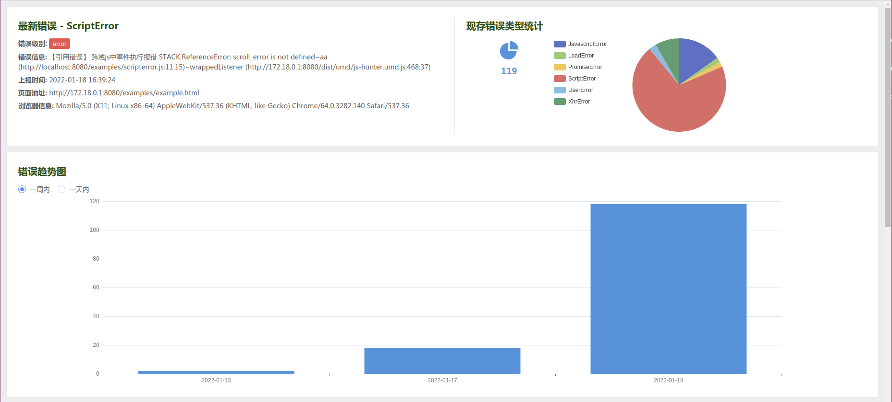
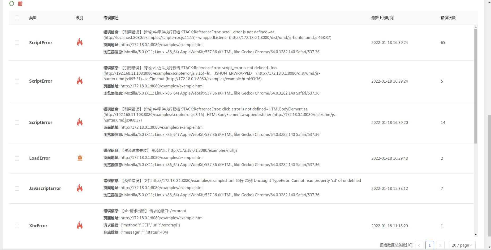

# 前端异常监控服务端

## 目录结构

```
- build 后端服务镜像构建目录
    - out 打包后的文件
- src 项目源文件
- docker-compose.yml 线上环境配置
- docker-compose-dev.yml 开发环境配置
- package.json
```

## 数据库设计

### 数据库

- log_day 每天上报错误数量表
- log_info 错误详情表

### 数据阀值(暂定)

- 只保存七天内的数据
- 相同 eventKey 的数据最多记录 200 条
- 总共存储 10w 条数据

## 如何使用

### 开发环境

启动 docker 容器

```
docker-compose -f docker-compose-dev.yml up -d
```

### 部署

打包项目

```
npm run build
```

创建镜像并标记本地镜像

```
cd ./build
docker build -t js-hunter-server-build:tag .
docker tag js-hunter-server-build:tag  yourlibrary/js-hunter-server-build:tag
```

推送镜像

```
docker push yourlibrary/js-hunter-server-build:tag
```

利用`MobaXterm`工具, 上传 `docker-compose.yml`文件.
在 `docker-compose.yml` 所在目录, 启动 docker 容器

```
docker-compose up -d
```

## 平台展示

`/logs.html`


